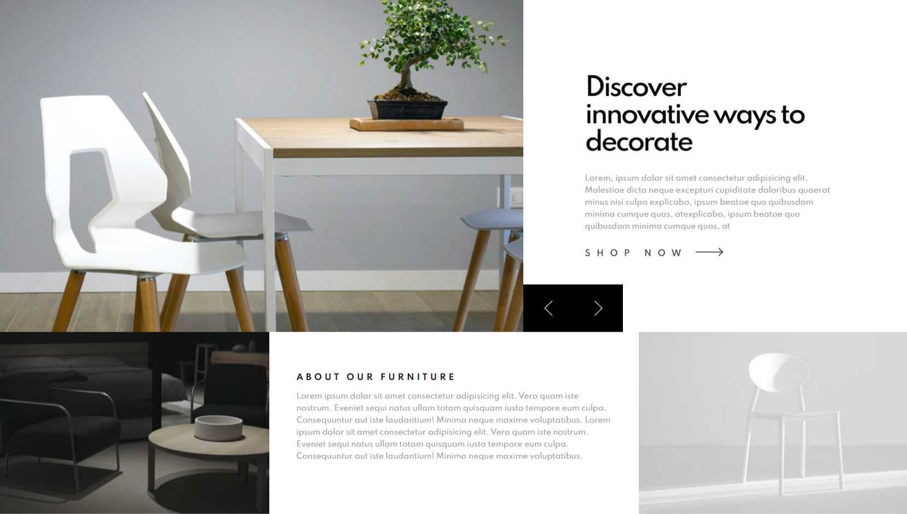
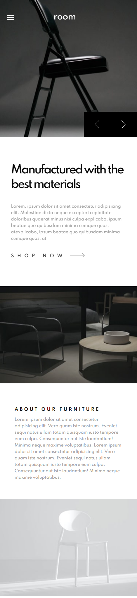

# Frontend Mentor - Room homepage solution

This is a solution to the [Room homepage challenge on Frontend Mentor](https://www.frontendmentor.io/challenges/room-homepage-BtdBY_ENq). Frontend Mentor challenges help you improve your coding skills by building realistic projects.

## Table of contents

- [Overview](#overview)
  - [The challenge](#the-challenge)
  - [Screenshot](#screenshot)
  - [Links](#links)
- [My process](#my-process)
  - [Built with](#built-with)
- [Author](#author)

## Overview

### The challenge

Users should be able to:

- View the optimal layout depending on their device's screen size

### Screenshot

- Web view
  
- Phone view
  

### Links

- Solution URL: [Github](https://github.com/Akhlak-Hossain-Jim/room-landing-page)
- Live Site URL: [Netlify Page](https://ahj-frontendmentorio-iii.netlify.app)

## My process

### Built with

- Reactjs
- Styled-component properties
- Flexbox
- CSS Grid

## Author

- Website - [Akhlak Hossain Jim](http://akhlak-hossain-jim.github.io/)
- Frontend Mentor - [@Akhlak-Hossain-Jim](https://www.frontendmentor.io/profile/Akhlak-Hossain-Jim)
- Twitter - [@ahossainjim](https://twitter.com/ahossainjim)
